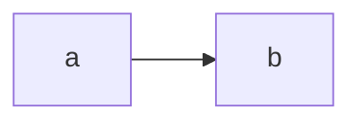

Flowershow was designed with Obsidian users in mind, and so, it aims to fully support Obsidian syntax, including **CommonMark**, **GitHub Flavoured Markdown** and **Obsidian extensions**, like Wikilinks. Here is a list of the most important ones:

## Headings

In Markdown you can create headings in two main ways — ATX style (with `#`) and Setext style (with `=` and `-`).

### ATX Headings

Use 1–6 # symbols:
```
# Heading 1
## Heading 2
### Heading 3
#### Heading 4
##### Heading 5
###### Heading 6
```

> [!note]
> A space after `#` is required (`## Heading` not `##Heading`)

### Setext Headings

Only for H1 and H2 — underline with `=` or `-`:

```
Heading 1
===============

Heading 2
---------------
```

> [!note]
> Headings automatically generate anchors for linking:
> `[Jump to section](#my-heading)`
> You can get the full URL with a heading by hovering over a heading and clicking on the `#` icon on the left.

> [!tip] Tips
> - Use Heading 1 only once per page for proper HTML semantics
> - Use headings logically (H2 → H3 under it, etc.)

## Thematic breaks

Thematic breaks can be made with three `*`, `-` or `_`.

**Example:**

```md
***
---
___
```

***
---
___

## Emphasis

**I'm Bold!** is done with `**I'm Bold!**`  
**I'm Bold!** is done with `__I'm Bold!__`

*I'm Italic!* is done with `*I'm Italic!*`  
*I'm Italic!* is done with `_I'm Italic!_`

*Italic with **bold** inside* is done with `*Italic with **bold** inside*`  
_Italic with __bold__ inside_ is done with `_Italic with __bold__ inside_`

~~Strikethrough~~ is done with `~~Strikethrough~~`  
==Highlight== is done with `==Highlight==`  
`Inline code` is done with `\`Inline code\``

## Paragraphs & Line breaks

### New paragraph

To start a new paragraph, leave a blank line between lines of text:

```md
This is paragraph one.

This is paragraph two.
```

This is paragraph one.

This is paragraph two.

### Soft Line Break (line break within the same paragraph)

A soft line break is just a newline in your editor and markdown treats it as a space.

```md
Line one
Line two (still same paragraph)
```

Line one
Line two (still same paragraph)

### Hard Line Break (force a line break)

To force a break without starting a new paragraph, use two spaces at the end of a line or a backslash (`\`):

**Option 1: Two spaces at end**
```md
Line one  
Line two
```

Line one  
Line two

**Option 2: Backslash**
```md
Line one\
Line two
```

Line one\
Line two

## Blockquotes

Blockquotes in Markdown let you quote text like a citation.
They work by prefixing lines with `>`.

**Basic blockquote**

```md
> This is a quote.
```

> This is a quote.

**Nested blockquotes (multi-level)**

Add another > for each level:

```md
> Level 1
>> Level 2
>>> Level 3
```

> Level 1
>> Level 2
>>> Level 3

**Blockquote with multiple paragraphs**

Leave a blank line inside and prefix every paragraph with `>`:

```md
> This is the first paragraph of a quote.
>
> This is the second paragraph.
```

> This is the first paragraph of a quote.
>
> This is the second paragraph.

**Blockquote with other elements (lists/code)**

Markdown inside still works:
```md
> Shopping list:
> - Apples
> - Bananas
```

> Shopping list:
> - Apples
> - Bananas

or code:
```md
> Code inside a quote:
>
> ```js
> console.log("Hi");
> ```
```

> Code inside a quote:
>
> ```js
> console.log("Hi");
> ```

## Lists

Markdown supports two main types of lists: **unordered** (bulleted) and **ordered** (numbered). You can also nest lists and mix types.

### Unordered Lists (bullets)

Use `-`, `*`, or `+` — they all work the same:

```md
- Item one
- Item two
- Item three
```

- Item one
- Item two
- Item three

### Ordered Lists (numbered)

```md
1. First item
2. Second item
3. Third item
```

1. First item
2. Second item
3. Third item

### Nested Lists

Indent sub-items with two or four spaces:
```md
- Groceries
    - Apples
    - Bananas
- Chores
    - Laundry
    - Dishes
```

- Groceries
    - Apples
    - Bananas
- Chores
    - Laundry
    - Dishes
 
### Mixed Lists

```md
1. Step one
2. Step two
   - Note A
   - Note B
3. Step three
```

1. Step one
2. Step two
   - Note A
   - Note B
3. Step three

### Task Lists

```md
- [x] one thing to do
- [ ] a second thing to do
  - [ ] another thing to do!
```

- [x] one thing to do
- [ ] a second thing to do
  - [ ] another thing to do!

## Code

### Inline code

Use backticks for short code snippets inside a sentence:

```md
Use the `print()` function.
```

Use the `print()` function.

### Fenced code blocks (multi-line)

Wrap code in triple backticks:

<pre>
```
const greeting = "Hello!"; console.log(greeting);
```
</pre>

```
const greeting = "Hello!"; console.log(greeting);
```

**Syntax highlighting**

Specify a language after the backticks:

<pre>
```python
class Example:
	def code(self,test):
		return 'Code highlighter'
```
</pre>

```python
class Example:
	def code(self,test):
		return 'Code highlighter'
```

### Inline code

**Example:**

```md
Here is some code: `print("hello world!")`
```

**Renders as:**

Here is some code: `print("hello world!")`

### Links

**Example:**

```md
[Link to roadmap](/docs/roadmap)
```

**Renders as:**

[Link to roadmap](/docs/roadmap)

### Images

**Example:**

```md

```

**Renders as:**


> [!NOTE]
> 🔍 To learn more about the Markdown syntax refer to the [CommonMark specification](https://spec.commonmark.org/0.30/).

---

## Tables

**Example:**

```md
| Left | Center | Right |
| :--- | :----: | ----: |
| 1    |   2    |     3 |
```

**Renders as:**

| Left | Center | Right |
| :--- | :----: | ----: |
| 1    |   2    |     3 |


## Autolinks

**Example:**

```md
Check out Flowershow at https://flowershow.app!
```

**Renders as:**

Check out Flowershow at https://flowershow.app!

> [!NOTE]
> 🔍 To learn more about the GitHub Flavored Markdown syntax refer to the [GFM specification](https://github.github.com/gfm/).

## Obisidian internal links (Wikilinks)

Wiki links are hyperlinks that give one-click access to other pages on the site. These are usually denoted with double square brackets `[[some_page]]` and Obsidian would generate the reference to that page automatically.

Flowershow will convert internal links to HTML `a` tags, with their `href` attributes pointing to the location referenced by original internal links.

**Internal link types**

- Link to a page, e.g. `[[/docs/blog]]`, which renders as [[/docs/blog]]
- Link to a page with a custom name, e.g. `[[/docs/blog|Blog support]]`, which renders as [[/docs/blog|Blog support]]
- Link to a specific heading within a given page `[[/docs/blog#Blog author frontmatter fields]]`, which renders as [[/docs/blog#Blog author frontmatter fields]]
- Link to a specific heading within a given page with a custom name, e.g. `[[/docs/blog#Blog author frontmatter fields|Some alias]]` which renders as [[/docs/blog#Blog author frontmatter fields|Some alias]]
- Link to an image file with supported image formats - png, jpg and jpeg, eg. `![[/assets/images/park.png]]` which renders as:
  ![[park.png]]
- 🚧 Link to a specific block (paragraph) within a given page, e.g. `[[/docs/blog#f93ba0]]`

> [!note]
> Note, that Flowershow will also handle Obsidian wiki links with "shortest path when possible" setting.

## Footnotes

**Example:**

```md
Roses are red... [^1]

[^1]: ...violets are blue.
```

Roses are red... [^1]

[^1]: ...violets are blue.

## Math

Place your math equation between `$`.

**Example:**

```markdown
$\sqrt{a^2 + b^2}$
```

**Renders as:**

$\sqrt{a^2 + b^2}$

Documentation on supported math syntax can be found in [KaTeX docs](https://katex.org/docs/support_table.html).

## Mermaid diagrams

Embed your diagram inside a code block with `mermaid` type.

**Example:**

````md

````

**Renders as:**


Read more about Mermaid diagrams on the [Mermaid website](https://mermaid.js.org/)..

## Dashes/Ellipse

Two '-' will convert to ndash. Three '-' will convert to mdash. Three '.' with or without spacing will convert to ellipse.

**Example:**

```md
--ndash
---mdash
...ellipse
. . .another ellipse
```

**Renders as:**\
–ndash\
—mdash\
...ellipse\
...another ellipse

## PDF embedding

**Example:**

```md
![[sample.pdf]]
```

**Renders as:**  
![[sample.pdf]]

## Callouts

**Example:**

```md
> [!info] This is cool!
> Here's a callout block.
> It supports **markdown** and [[abc|wikilinks]].
```

**Renders as:**

> [!info] This is cool!
> Here's a callout block.
> It supports **markdown** and [[abc|wikilinks]].

**Example:**

```md
> [!tip] Title-only callout
```

**Renders as:**

> [!tip] Title-only callout

**Example:**

```md
> [!faq]- Are callouts foldable?
> Yes! In a foldable callout, the contents are hidden when the callout is collapsed.
```

**Renders as:**

> [!faq]- Are callouts foldable?
> Yes! In a foldable callout, the contents are hidden when the callout is collapsed.

**Example:**

```md
> [!question] Can callouts be nested?
> > [!todo] Yes!, they can.
> > > [!example]  You can even use multiple layers of nesting.
```

**Renders as:**

> [!question] Can callouts be nested?
> > [!todo] Yes!, they can.
> > > [!example]  You can even use multiple layers of nesting.

**Supported callout types:**
Flowershow supports 13 different Obsidian callout types (with aliases) like note, abstract, todo, or tip. See this [Obsidian docs page](https://help.obsidian.md/How+to/Use+callouts) to learn more about different callout types.

## Comments

**Example:**

```md
Here is some invisible inline comment: {/* comment! */}

Here is an invisible multiline comment:

{/*
multi
line
comment!
*/}
```

**Renders as:**

Here is some invisible inline comment: {/* comment! */}

Here is an invisible multiline comment:

{/*
multi
line
comment!
*/}
